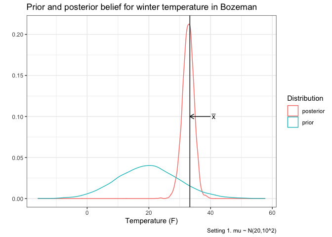
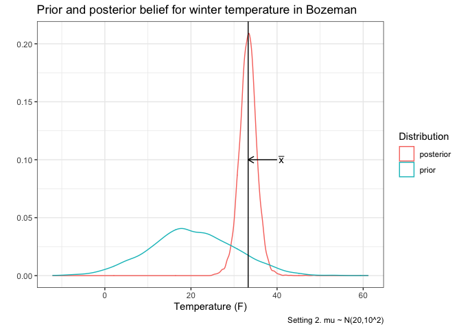
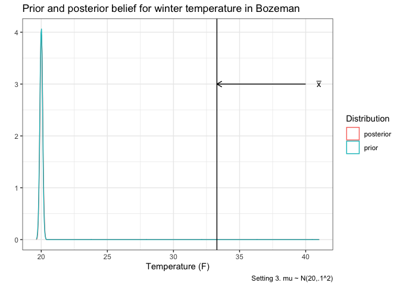
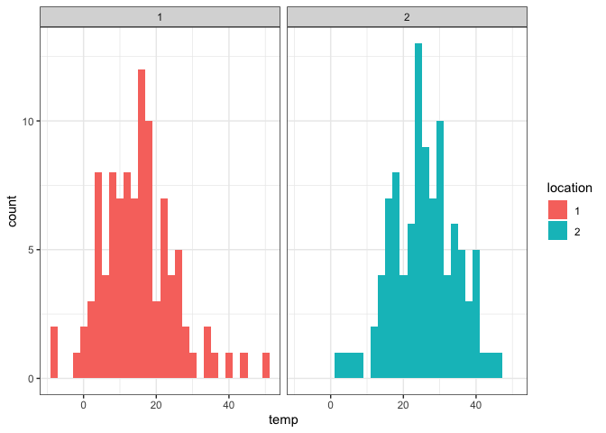
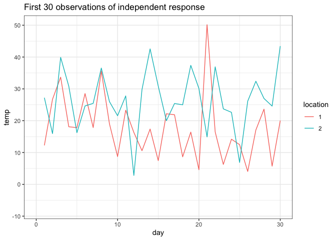
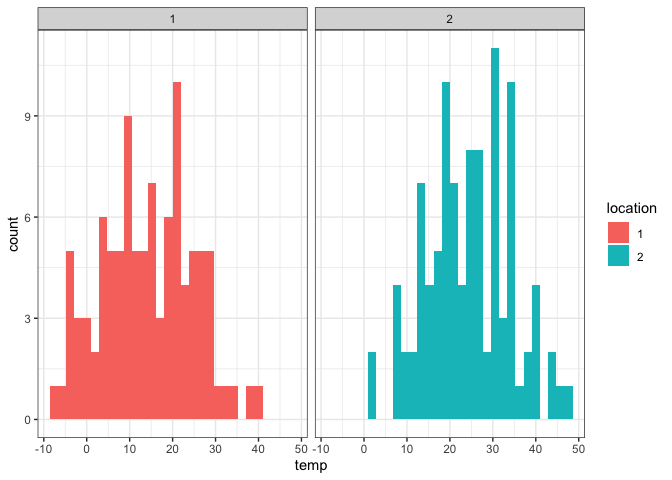
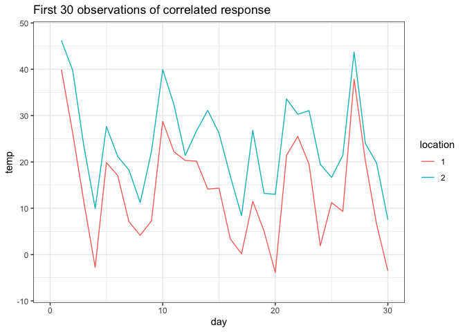

Lecture 4: Stan Demo + Multivariate Normal intro
================

#### Stan Overview

Recall the weather data from Bridger Bowl in January of 2021.

``` r
temp <- c(26, 45, 44, 36, 22, 25, 31, 31, 37, 34, 35, 37, 32, 31)
```

We are going to fit a few this model in stan but we will vary the prior
distribution to assess how the posterior distribution and results
change.

##### 1\. Stan Code

First re-write the stan code to allow mu and sigma to be specified by
the user and passed to stan.

``` stan
data {
  int<lower=0> N;
  vector[N] y;
  real mu0;
  real<lower=0> sigma0;
}

parameters {
  real mu;
  real<lower=0> sigma;
}

model {
  y ~ normal(mu, sigma);
  mu ~ normal(mu0, sigma0);
}
```

##### 2\. Compute Posterior with Different Priors

Use the model to estimate the mean high temperature, but using the
different prior structures below:

1.  mu \~ N(20,10^2)

<!-- end list -->

``` r
prior1 <- stan("bridger.stan", data=list(N = length(temp), y=temp, mu0 = 20, sigma0 = 10))
```

``` r
print(prior1, pars = 'mu')
```

    ## Inference for Stan model: bridger.
    ## 4 chains, each with iter=2000; warmup=1000; thin=1; 
    ## post-warmup draws per chain=1000, total post-warmup draws=4000.
    ## 
    ##     mean se_mean   sd  2.5%   25%   50%   75% 97.5% n_eff Rhat
    ## mu 32.72    0.04 1.91 28.83 31.52 32.76 33.98 36.26  2536    1
    ## 
    ## Samples were drawn using NUTS(diag_e) at Thu Jan 28 11:01:51 2021.
    ## For each parameter, n_eff is a crude measure of effective sample size,
    ## and Rhat is the potential scale reduction factor on split chains (at 
    ## convergence, Rhat=1).

2.  mu \~ N(20,1000^2)

<!-- end list -->

``` r
print(prior2, pars = 'mu')
```

    ## Inference for Stan model: bridger.
    ## 4 chains, each with iter=2000; warmup=1000; thin=1; 
    ## post-warmup draws per chain=1000, total post-warmup draws=4000.
    ## 
    ##     mean se_mean   sd  2.5% 25%   50%   75% 97.5% n_eff Rhat
    ## mu 33.26    0.05 2.07 29.13  32 33.28 34.52 37.25  2013    1
    ## 
    ## Samples were drawn using NUTS(diag_e) at Thu Jan 28 11:01:52 2021.
    ## For each parameter, n_eff is a crude measure of effective sample size,
    ## and Rhat is the potential scale reduction factor on split chains (at 
    ## convergence, Rhat=1).

3.  mu \~ N(20,.1^2)

<!-- end list -->

``` r
print(prior3, pars = 'mu')
```

    ## Inference for Stan model: bridger.
    ## 4 chains, each with iter=2000; warmup=1000; thin=1; 
    ## post-warmup draws per chain=1000, total post-warmup draws=4000.
    ## 
    ##     mean se_mean  sd  2.5%   25%   50%   75% 97.5% n_eff Rhat
    ## mu 20.01       0 0.1 19.81 19.94 20.01 20.08 20.21  3607    1
    ## 
    ## Samples were drawn using NUTS(diag_e) at Thu Jan 28 11:01:53 2021.
    ## For each parameter, n_eff is a crude measure of effective sample size,
    ## and Rhat is the potential scale reduction factor on split chains (at 
    ## convergence, Rhat=1).

4.  Explore another prior distribution. If you want to challenge
    yourself

##### 3\. Visualize Posterior and Prior

1.  mu \~ N(20,10^2)

<!-- end list -->

``` r
tibble(sims = c(extract(prior1, pars = 'mu')$mu,rnorm(4000, 20, 10)), 
       Distribution = rep(c('posterior','prior'), each = 4000)) %>% 
  ggplot(aes(x = sims, color = Distribution)) + 
  geom_density() + theme_bw() + 
  xlab('Temperature (F)') + ylab('') + 
  ggtitle("Prior and posterior belief for winter temperature in Bozeman") +
  labs(caption = 'Setting 1. mu ~ N(20,10^2)') +
  geom_vline(xintercept = mean(temp)) +
  annotate('text',label = expression(bar(x)), x=41, y=.1) +
  annotate('segment', arrow = arrow(length = unit(.1, 'inches')), x = 40, y = .1, yend = .1, xend = mean(temp))
```

<!-- -->

2.  mu \~ N(20,1000^2)

<!-- end list -->

``` r
tibble(sims = c(extract(prior2, pars = 'mu')$mu,rnorm(4000, 20, 10)), 
       Distribution = rep(c('posterior','prior'), each = 4000)) %>% 
  ggplot(aes(x = sims, color = Distribution)) + 
  geom_density() + theme_bw() + 
  xlab('Temperature (F)') + ylab('') + 
  ggtitle("Prior and posterior belief for winter temperature in Bozeman") +
labs(caption = 'Setting 2. mu ~ N(20,10^2)') +
  geom_vline(xintercept = mean(temp)) +
  annotate('text',label = expression(bar(x)), x=41, y=.1) +
  annotate('segment', arrow = arrow(length = unit(.1, 'inches')), x = 40, y = .1, yend = .1, xend = mean(temp))  
```

<!-- -->

3.  mu \~ N(20,.1^2)

<!-- end list -->

``` r
tibble(sims = c(extract(prior3, pars = 'mu')$mu,rnorm(4000, 20, .10)), 
       Distribution = rep(c('posterior','prior'), each = 4000)) %>% 
  ggplot(aes(x = sims, color = Distribution)) + 
  geom_density() + theme_bw() + 
  xlab('Temperature (F)') + ylab('') + 
  ggtitle("Prior and posterior belief for winter temperature in Bozeman") +
labs(caption = 'Setting 3. mu ~ N(20,.1^2)') +
  geom_vline(xintercept = mean(temp)) +
  annotate('text',label = expression(bar(x)), x=41, y=3) +
  annotate('segment', arrow = arrow(length = unit(.1, 'inches')), x = 40, y = 3, yend = 3, xend = mean(temp))  
```

<!-- -->

#### Multivariate Normal Distribution

Next we will segue from standard linear models to analyzing correlated
data.

First we will start with the a bivariate normal distribution: y \~
N(theta,sigma), where theta is a mean vector and sigma = sigmasq \* I is
a covariance matrix.

To provide a motivating context, not consider jointly estimating the
temperature at Bridger Bowl *and* Big Sky Resort.

##### 1\. Simulate independent bivariate normal

Simulate a set of temperature values from each location, where the
temperature values are independent (sigma = sigmasq \* I)

``` r
library(mnormt)
n <- 100
theta <- c(15,25)
sigma <- diag(2) * 100
fake_temperatures <- rmnorm(n, theta , sigma)
```

Then create a few graphs to show marginal distribution of temperature as
well as how the temperatures evolve in time.

``` r
library(reshape2)
melt(fake_temperatures, value.name = 'temp') %>% 
  rename(location = Var2) %>%
  mutate(location = factor(location)) %>% 
  ggplot(aes(x =temp, fill = location)) + 
  geom_histogram() +
  facet_wrap(.~location) + theme_bw() 
```

<!-- -->

``` r
melt(fake_temperatures, value.name = 'temp') %>% 
  rename(location = Var2, day = Var1) %>%
  mutate(location = factor(location)) %>%
  ggplot(aes(y =temp, x = day, color = location )) + 
  geom_line() + theme_bw() + xlim(0,30) + 
  ggtitle('First 30 observations of independent response')
```

<!-- -->

##### 2\. Simulate correlated bivariate normal

Simulate a set of temperature values from each location, where the
temperature values are not independent (sigma = sigmasq \* H), where H
is a correlation matrix. (Note there are some constraints we will
discuss later)

``` r
sigma <- matrix(c(1, .9, .9, 1), nrow = 2, ncol = 2) * 100
fake_temperatures_corr <- rmnorm(n, theta , sigma)
```

Then create a few graphs to show marginal distribution of temperature as
well as how the temperatures evolve in time.

``` r
melt(fake_temperatures_corr, value.name = 'temp') %>% 
  rename(location = Var2) %>%
  mutate(location = factor(location)) %>% 
  ggplot(aes(x =temp, fill = location)) + geom_histogram() +
  facet_wrap(.~location) + theme_bw()
```

<!-- -->

``` r
melt(fake_temperatures_corr, value.name = 'temp') %>% 
  rename(location = Var2, day = Var1) %>%
  mutate(location = factor(location)) %>%
  ggplot(aes(y =temp, x = day,color = location )) + 
  geom_line() + theme_bw() + xlim(0,30) +
  ggtitle('First 30 observations of correlated response')
```

<!-- -->

##### 3\. Write STAN code for bivariate normal

Write stan code that will allow you to estimate theta and sigma
(including H)

``` stan
data {
  int<lower=0> p;
  int<lower=0> N;
  matrix[N,p] y;
}

parameters {
  vector[p] theta;
  corr_matrix[p] H;
  real<lower = 0> sigma;
}

model {
  for(i in 1:N){
    y[i,:] ~ multi_normal(theta, sigma*H);
  }
}
```

##### 4\. Use STAN to estimate bivariate normal parameters

Use your stan code to estimate theta and sigma (including H and sigmasq)

``` r
indep_mvn <- stan("multi_norm.stan", 
                  data=list(N = nrow(fake_temperatures), 
                            p = ncol(fake_temperatures), 
                            y=fake_temperatures))
```

``` r
print(indep_mvn)
```

    ## Inference for Stan model: multi_norm.
    ## 4 chains, each with iter=2000; warmup=1000; thin=1; 
    ## post-warmup draws per chain=1000, total post-warmup draws=4000.
    ## 
    ##             mean se_mean   sd    2.5%     25%     50%     75%   97.5% n_eff
    ## theta[1]   15.12    0.01 0.96   13.25   14.47   15.13   15.79   16.96  4714
    ## theta[2]   25.79    0.01 0.97   23.93   25.18   25.79   26.45   27.72  4375
    ## H[1,1]      1.00     NaN 0.00    1.00    1.00    1.00    1.00    1.00   NaN
    ## H[1,2]      0.03    0.00 0.10   -0.17   -0.04    0.03    0.09    0.22  3946
    ## H[2,1]      0.03    0.00 0.10   -0.17   -0.04    0.03    0.09    0.22  3946
    ## H[2,2]      1.00    0.00 0.00    1.00    1.00    1.00    1.00    1.00  4060
    ## sigmasq    93.81    0.15 9.70   76.55   87.05   93.22   99.87  114.86  4150
    ## lp__     -547.78    0.03 1.41 -551.42 -548.47 -547.46 -546.75 -546.04  1942
    ##          Rhat
    ## theta[1]    1
    ## theta[2]    1
    ## H[1,1]    NaN
    ## H[1,2]      1
    ## H[2,1]      1
    ## H[2,2]      1
    ## sigmasq     1
    ## lp__        1
    ## 
    ## Samples were drawn using NUTS(diag_e) at Thu Jan 28 11:03:07 2021.
    ## For each parameter, n_eff is a crude measure of effective sample size,
    ## and Rhat is the potential scale reduction factor on split chains (at 
    ## convergence, Rhat=1).

``` r
corr_mvn <- stan("multi_norm.stan", 
                 data=list(N = nrow(fake_temperatures_corr),
                           p = ncol(fake_temperatures_corr), 
                           y=fake_temperatures_corr))
```

``` r
print(corr_mvn)
```

    ## Inference for Stan model: multi_norm.
    ## 4 chains, each with iter=2000; warmup=1000; thin=1; 
    ## post-warmup draws per chain=1000, total post-warmup draws=4000.
    ## 
    ##             mean se_mean    sd    2.5%     25%     50%     75%   97.5% n_eff
    ## theta[1]   14.12    0.02  1.05   11.99   13.42   14.10   14.82   16.17  1814
    ## theta[2]   24.42    0.02  1.06   22.36   23.72   24.43   25.13   26.52  1831
    ## H[1,1]      1.00     NaN  0.00    1.00    1.00    1.00    1.00    1.00   NaN
    ## H[1,2]      0.91    0.00  0.02    0.87    0.89    0.91    0.92    0.94  2297
    ## H[2,1]      0.91    0.00  0.02    0.87    0.89    0.91    0.92    0.94  2297
    ## H[2,2]      1.00     NaN  0.00    1.00    1.00    1.00    1.00    1.00   NaN
    ## sigmasq   106.82    0.32 15.19   81.23   96.12  105.58  115.79  141.25  2208
    ## lp__     -475.52    0.04  1.44 -479.00 -476.24 -475.17 -474.45 -473.73  1260
    ##          Rhat
    ## theta[1]    1
    ## theta[2]    1
    ## H[1,1]    NaN
    ## H[1,2]      1
    ## H[2,1]      1
    ## H[2,2]    NaN
    ## sigmasq     1
    ## lp__        1
    ## 
    ## Samples were drawn using NUTS(diag_e) at Thu Jan 28 11:03:50 2021.
    ## For each parameter, n_eff is a crude measure of effective sample size,
    ## and Rhat is the potential scale reduction factor on split chains (at 
    ## convergence, Rhat=1).

##### 5\. Final Thoughts About Correlation

In many statistical models there is an assumption about independence.
When independence is violated, uncertainty is under estimated and in
incorrect inferences can be made.

While lack of independence often has a negative connotation, in spatial
statistics we can actually exploit correlation. For instance, by knowing
the temperature at the weather station at Bozeman High School or Bridger
Bowl, we can estimate temperature at other locations.
